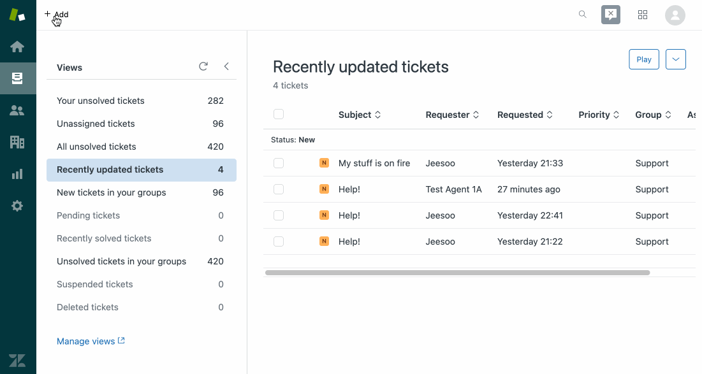
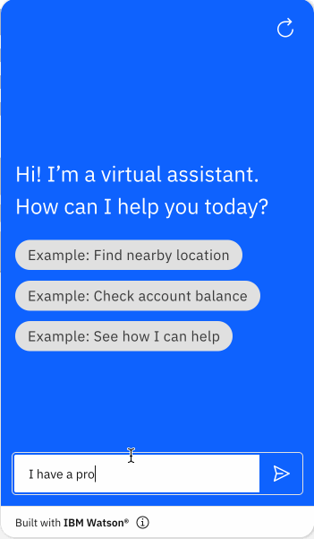
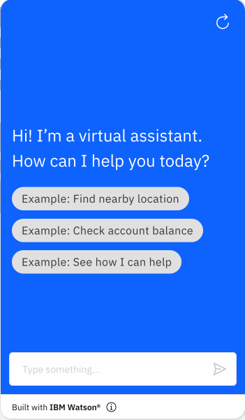

# Zendesk Support Custom Extension

Zendesk is a business tool for facilitating effective customer service, managing teams, and monitoring associated metrics.

In this starter kit, we have the following API endpoints implemented for use:
- POST Create Ticket
- GET List Tickets
- PUT Update Ticket
- GET Get Ticket Comments

Zendesk Support uses `Requests API` to manage tickets - you can find the documentation [here](https://developer.zendesk.com/api-reference/ticketing/tickets/ticket-requests).

**IMPORTANT NOTE**: We do not yet support dynamic username population (which will allow different users to post information on the ticket). This means that this starter kit should currently be used for demo purposes only, since the ticketing operations will only be able to be performed in the perspective of a single user for whom the security credentals have been configured.

## Pre-Req: Getting Auth Keys and Configuring Your Server
Zendesk requires you to have authentication in order to have fully functioning API endpoints. You will also need ensure a few settings are enabled in order to allow these API calls.

1. Navigate to the `Admin Center` - i.e. `https://{server-domain}.zendesk.com/admin`
1. On the left hand menu, go to `Apps and integrations` > `APIs` > `Zendesk API`.
1. Under `Settings`:
    - To enable username/password auth, toggle `Password access` to `Enabled`. (Not recommended)
    - To enable API token authentication (API Key), toggle `Token access` to `Enabled`, and click `Add API token`. Note that you will need to append `/token` to the end of your username (email) if you are using this option. (Recommended)
1. You will now be able to use `{your_email}/token` and the generated `API token` to hit Zendesk's API, where `your_email` is the email of your verified (or unverified) user. You should use these credentials when adding your custom extension to your assistant.

<br>

## (Semi-Optional) Add End Users
Anonymously opened tickets are supported by the API - *but* the features available and the capacity of such tickets are limited. In order to create a ticket that is associated with a verified user, you will have to manually create the user, and verify the account. 

1. Under `+ Add`, navigate to `New` > `User`
1. Enter the user's `Name` and `Email`, with User type `End user`. Click `Add`.
  **NOTE**: If you're planning to use verified end users, you will need to use this email later.
1. On the newly created user, find the email on the left hand menu, and open the dropdown. Click `Verify email`.
1. Go to `Security Settings` for the user.
1. Click the `reset` button next to the password. This will sent an email to the user to set the password for the account.

This account will now be able to add and update their ticket using their email and password credentials.

<br>

## Using this Starter Kit
Upload the provided OpenAPI spec as a custom extension, and add your token to the Auth section when prompted. After upload, the actions should be configured to use the fields below for the skill to be fully functional. Follow the instructions [here](../../README.md#configuring-your-actions-skill-to-use-an-extension) and note the information below to do this.

- **Action 1.** Create a ticket.
    ```
    Operation: Create Ticket
    Parameters:
      - request.comment.body: 4. Sorry to hear that ...
      - request.subject: 3. Thanks! Alright, in just a ...

      [For Anonymous Tickets]
      - request.requester.name: 1. Yeah, of course! May I ask you ...
      - request.requester.email: 2. Hey, {variable}, Can I also ...
    ```

- **Action 2.** Update ticket for a given id.
    ```
    Operation: Update Ticket
    Parameters:
      - id: 1. Of course, let's get your ...
      - request.comment.body: 2. So your ticket id is {variable} ...
    ```

- **Action 3.** Get all my tickets.
    ```
    Operation: List Tickets
    Parameters:
      - None
    ```

- **Action 4.** Get comments on a specific ticket.
    ```
    Operation: Get Ticket Comments
    Parameters:
      - id: 1. Of course. What's the ticket ID?
    ```

## Example Usage
A conversation using this starter kit could look like the following:<br>




Free free to contribute to this starter kit, or add other starter kits by following these [contribution guidelines](../../docs/CONTRIBUTING.md).